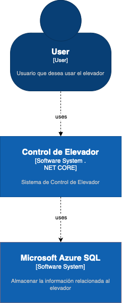
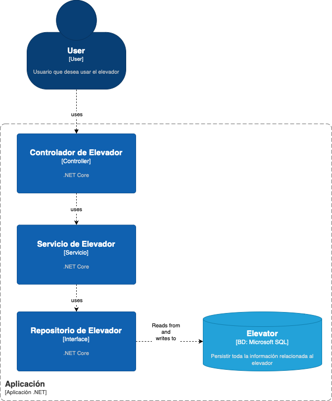
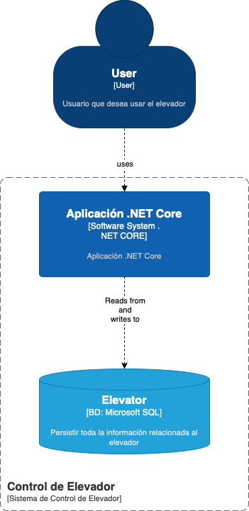

# 📖 README - TechnicalTestMasiv

## Descripción

Este proyecto representa una implementación para controlar y gestionar el estado de un elevador. Utiliza una base de datos para almacenar el estado actual del elevador, incluyendo el piso en el que se encuentra y su estado (por ejemplo, en movimiento, parado, etc.).

## Configuración inicial

1. **Instalación de dependencias**: Asegúrate de tener instalado `.NET Core`.
   ```bash
   dotnet restore
   ```

2. **Restaurar las dependencias**:
   ```bash
   dotnet restore
   ```

## Base de datos

El proyecto utiliza Entity Framework Core para interactuar con una base de datos. Asegúrate de tener configurada la cadena de conexión en `appsettings.json`.

### Migraciones

Para crear o actualizar la base de datos utilizando las migraciones de Entity Framework:

```bash
dotnet ef database update
```

## Funcionamiento

El proyecto permite realizar las siguientes acciones:

1. **StartElevator:**
Inicia el funcionamiento del elevador. Si es la primera vez, inicializa el estado y el piso actual en la base de datos.
Luego, este método activa el movimiento del elevador o inicia una simulación del mismo, actualizando periódicamente el piso actual.

2. **MoveElevatorAsync:**
Una función asíncrona que se encarga de cambiar el piso del elevador. Utiliza el repositorio de datos (MyDataRepository) para actualizar el piso en tiempo real en la base de datos.
Podría gestionar lógicas adicionales relacionadas con el movimiento real del elevador, como la gestión de puertas, señales de seguridad, etc.

3. **GetCurrentFloor:**
Consulta y devuelve el piso actual del elevador, permitiendo que otros sistemas o usuarios conozcan en qué piso se encuentra el elevador en cualquier momento.

4. **GetElevatorStatus:**
Proporciona el estado actual del elevador (e.g., "Moviendo", "Parado"). Esto es crucial para sistemas de monitoreo y seguridad para saber si el elevador está en operación o no.

5. **SetElevatorStatus:**
Permite cambiar el estado del elevador. Esto podría ser útil en situaciones de mantenimiento, emergencia o simplemente al finalizar un ciclo de operación.

## Consideraciones de Prioridad

Dado que se desea mantener solo un registro en la tabla `ElevatorStates` para rastrear el piso y estado actuales del elevador:

- Cuando se realiza una petición para actualizar el piso o el estado del elevador, el sistema primero verifica si ya existe un registro en la base de datos.
- Si el registro existe, se actualiza el valor correspondiente (piso o estado).
- Si no existe, se crea un nuevo registro con el piso o estado proporcionados.

## 🚀 Pruebas del Controlador del Elevador usando Postman

A continuación, se detalla cómo probar el `ElevatorController` usando Postman.

### Configuración inicial:

1. Asegúrate de que tu aplicación esté corriendo localmente (por defecto en `http://localhost:5000` o `http://localhost:5001` para HTTPS).
2. Abre Postman.

### 🟢 Iniciar el Elevador

1. **Endpoint**: `http://localhost:5000/elevator/start`
2. **Método**: POST
3. **Body**: No requerido.
4. **Respuesta exitosa**: Status 200 OK.
5. **Respuesta fallida**: "Elevator is already in motion." si el elevador ya está en movimiento.

### 🟢 Mover el Elevador a un Piso Específico

1. **Endpoint**: `http://localhost:5000/elevator/move`
2. **Método**: POST
3. **Body** (raw, JSON): 
```json
[Número del piso]
```
4. **Respuesta exitosa**: Status 200 OK.

### 🟢 Llamar al Elevador desde un Piso

1. **Endpoint**: `http://localhost:5000/elevator/call`
2. **Método**: POST
3. **Body** (raw, JSON): 
```json
[Número del piso desde donde se llama]
```
4. **Respuesta exitosa**: Status 200 OK.

### 🟢 Obtener el Estado Actual del Elevador

1. **Endpoint**: `http://localhost:5000/elevator/state`
2. **Método**: GET
3. **Respuesta**: Un objeto JSON con el piso actual (`CurrentFloor`) y una lista de los pisos pendientes (`PendingFloors`).

Ejemplo de respuesta:
```json
{
    "CurrentFloor": 3,
    "PendingFloors": [5, 7]
}
```
## Ejecutando las Pruebas
Navega al Directorio del Proyecto de Pruebas:
Cambia tu directorio actual al directorio del proyecto de pruebas. Aquí es donde se encuentra el archivo .csproj de tu proyecto de pruebas.

```cmd
cd ruta/al/proyecto/de/pruebas
```

#### Ejecuta las Pruebas:
Utiliza el comando dotnet test para ejecutar todas las pruebas del proyecto:

```cmd
dotnet test
```

#### Revisa los Resultados:
Después de ejecutar el comando, verás una salida indicando los resultados de las pruebas. Mostrará qué pruebas pasaron y cuáles fallaron, junto con cualquier mensaje de error relevante para las pruebas que fallaron.

### Consideraciones:

- Asegúrate de que la base de datos esté configurada y corriendo, ya que el controlador interactúa con ella.
- El método `MoveElevatorAsync` en el controlador es un método privado y, por lo tanto, no puede ser llamado directamente desde una solicitud HTTP, pero se invoca internamente por otros métodos.
- El retraso de 1 segundo en `MoveElevatorAsync` simula el movimiento del elevador entre pisos, así que ten en cuenta que puede haber un retraso entre cuando llamas al elevador y cuando alcanza el piso objetivo.

### Diagramas

> **Nota:** Los diagramas tienen el fondo transparente por ende si se ven en un IDE con fondo oscuro las relaciones no se notarán, recomiendo usar un fondo claro para la visualización optima de los mismos.





